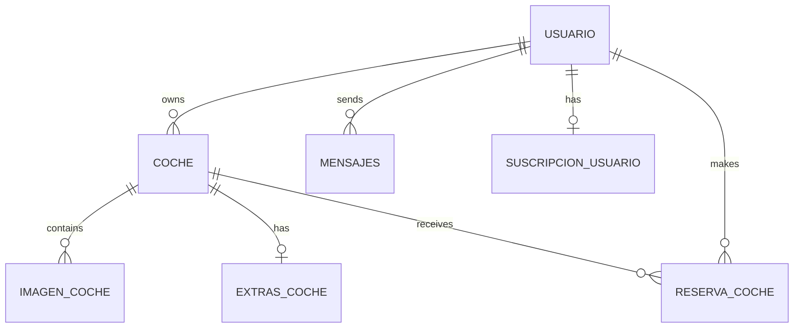

## Overview

SocialiCar uses a relational MySQL database with a normalized schema designed to support peer-to-peer car sharing operations, user management, messaging, and payment processing.

<Note>
  The database schema is inferred from application code as no SQL schema files are included in the repository.
</Note>

## Entity Relationship Diagram



## Core Tables

### Usuario (Users)

Stores user account information and authentication credentials.

<Tabs>
  <Tab title="Schema">
    | Column | Type | Constraints | Description |
    |--------|------|-------------|-------------|
    | `identificacion` | VARCHAR | PRIMARY KEY | DNI/NIE/NIF (Spanish ID) |
    | `tipo_identificacion` | ENUM | NOT NULL | 'dni', 'nie', 'nif' |
    | `nombre` | VARCHAR | NOT NULL | User first name |
    | `apellido` | VARCHAR | NOT NULL | User last name |
    | `correo` | VARCHAR | UNIQUE, NOT NULL | Email address (login) |
    | `contrasena` | VARCHAR | NOT NULL | Hashed password |
    | `telefono` | VARCHAR(15) | NOT NULL | Phone number (9-15 digits) |
    | `fecha_nacimiento` | DATE | NOT NULL | Birth date (18+ required) |
    | `foto_perfil` | VARCHAR | NULL | Profile photo path |
    | `ruta_img_identificacion` | VARCHAR | NULL | ID document photo path |
    | `ruta_img_carnet` | VARCHAR | NULL | Driver's license photo path |
    | `verificado` | TINYINT | DEFAULT 0 | Account verification status |
    | `estado` | TINYINT | DEFAULT 1 | 1 = Online, 0 = Offline |
    | `fecha_registro` | TIMESTAMP | DEFAULT CURRENT_TIMESTAMP | Registration date |
  </Tab>
  
  <Tab title="Validation Rules">
    ```php
    // Email validation
    if (filter_var($correo, FILTER_VALIDATE_EMAIL) == false) {
        $err_correo = "El correo tiene que tener el @ y el . bien colocados";
    }
    
    // Password requirements
    $patron = "/^(?=.*[a-z])(?=.*[A-Z])(?=.*\d).+$/";
    if (!preg_match($patron, $contrasena)) {
        $err_contrasena = "La contraseña tiene que tener al menos 1 mayuscula, 1 minuscula y 1 numero";
    }
    
    // Age verification
    if (date("Y") - date("Y", strtotime($fecha_nacimiento)) < 18) {
        $err_fecha_nacimiento = "Tienes que ser mayor de edad para registrarte";
    }
    
    // DNI pattern
    $patron = "/^[0-9]{8}[A-Za-z]$/";
    
    // NIE pattern
    $patron = "/^[XYZ][0-9]{7}[A-Za-z]$/";
    ```
  </Tab>
  
  <Tab title="Example Query">
    ```php
    // User registration
    $sql = $_conexion->prepare("INSERT INTO usuario (
        identificacion, tipo_identificacion, nombre, apellido, correo, 
        contrasena, telefono, foto_perfil, ruta_img_identificacion, 
        ruta_img_carnet, verificado, fecha_nacimiento, estado
    ) VALUES (?, ?, ?, ?, ?, ?, ?, ?, ?, ?, 0, ?, 1)");
    
    // User authentication
    $sql = $_conexion->prepare("SELECT * FROM usuario WHERE correo = ?");
    $sql->bind_param("s", $correo);
    $sql->execute();
    $resultado = $sql->get_result();
    $datos_usuario = $resultado->fetch_assoc();
    $acceso_concedido = password_verify($contrasena, $datos_usuario["contrasena"]);
    ```
  </Tab>
</Tabs>

<Warning>
  The `identificacion` field serves as the primary key and references Spanish identification documents. International users may require schema modifications.
</Warning>

### Coche (Vehicles)

Stores vehicle listings with detailed specifications and location data.

<Tabs>
  <Tab title="Schema">
    | Column | Type | Constraints | Description |
    |--------|------|-------------|-------------|
    | `matricula` | VARCHAR | PRIMARY KEY | License plate number |
    | `id_usuario` | VARCHAR | FOREIGN KEY | Owner's identificacion |
    | `marca` | VARCHAR(50) | NOT NULL | Car brand |
    | `modelo` | VARCHAR(50) | NOT NULL | Car model |
    | `color` | ENUM | NOT NULL | 'white','black','gray','red','blue','green','yellow','orange','brown','others' |
    | `anno_matriculacion` | DATE | NOT NULL | Registration date (YYYY-MM) |
    | `kilometros` | INT | NOT NULL | Mileage |
    | `combustible` | ENUM | NOT NULL | 'gasolina','diesel','hibrido','electrico','glp','gnc' |
    | `tipo` | ENUM | NOT NULL | 'berlina','coupe','deportivo','furgoneta','monovolumen','suv','pick-up','roadster','utilitario','familiar','autocaravana' |
    | `transmision` | ENUM | NOT NULL | 'manual','automatico' |
    | `precio` | DECIMAL(10,2) | NOT NULL | Daily rental price (€15-500) |
    | `potencia` | INT | NOT NULL | Engine power (HP) |
    | `numero_puertas` | TINYINT | NOT NULL | Door count (2-5) |
    | `numero_plazas` | TINYINT | NOT NULL | Seat capacity (1-9) |
    | `direccion` | TEXT | NOT NULL | Full address |
    | `ciudad` | VARCHAR | NOT NULL | City |
    | `provincia` | VARCHAR | NOT NULL | Province (lowercase) |
    | `codigo_postal` | VARCHAR(5) | NOT NULL | Postal code |
    | `pais` | VARCHAR | DEFAULT 'España' | Country |
    | `lat` | DECIMAL(10,8) | NULL | Latitude coordinate |
    | `lon` | DECIMAL(11,8) | NULL | Longitude coordinate |
    | `tipo_aparcamiento` | ENUM | NOT NULL | 'calle','garaje','parking' |
    | `descripcion` | VARCHAR(200) | NULL | Vehicle description |
    | `ruta_img_coche` | VARCHAR | NULL | Primary vehicle image |
    | `fecha_creacion` | TIMESTAMP | DEFAULT CURRENT_TIMESTAMP | Listing creation date |
  </Tab>
  
  <Tab title="Validation">
    ```php
    // License plate validation (Spanish format)
    $patron_actual = "/^[0-9]{4}[BCDFGHJKLMNPRSTVWXYZ]{3}$/";
    $patron_antiguo = "/^[A-Z]{1,2}[0-9]{4,6}[A-Z]{0,2}$/";
    
    // Price range
    if ($precio < 15 || $precio > 500) {
        $err_precio = "El precio debe estar entre 15 y 500";
    }
    
    // Address format validation
    // Must include: Street, City, Province, Postal Code, Country
    $partes_direccion = explode(",", $direccion);
    if (count($partes_direccion) < 5) {
        $err_direccion = "La dirección debe tener al menos 5 partes";
    }
    
    // Postal code (5 digits)
    if (!is_numeric($cp) || strlen($cp) != 5) {
        $err_direccion = "El código postal debe tener 5 dígitos";
    }
    
    // Country restriction
    if (strtolower($pais) !== "españa") {
        $err_direccion = "La dirección debe estar en España";
    }
    ```
  </Tab>
  
  <Tab title="Search Query">
    ```php
    // Search with filters and availability check
    $obtener_coche = $_conexion->prepare("
        SELECT coche.*, sus.tipo AS tipo_suscripcion
        FROM coche
        JOIN usuario ON coche.id_usuario = usuario.identificacion
        JOIN suscripcion_usuario sus 
            ON sus.identificacion = usuario.identificacion 
            AND sus.activo = TRUE 
            AND sus.tipo = 'Premium'
        WHERE coche.provincia = ?
        AND NOT EXISTS (
            SELECT 1 FROM reserva_coche 
            WHERE reserva_coche.matricula = coche.matricula 
            AND (
                (? BETWEEN reserva_coche.fecha_inicio AND reserva_coche.fecha_final) OR
                (? BETWEEN reserva_coche.fecha_inicio AND reserva_coche.fecha_final) OR
                (reserva_coche.fecha_inicio BETWEEN ? AND ?) OR
                (reserva_coche.fecha_final BETWEEN ? AND ?)
            )
        )
        ORDER BY coche.precio ASC
    ");
    ```
  </Tab>
</Tabs>

### Imagen_Coche (Vehicle Images)

Stores multiple images per vehicle listing.

| Column | Type | Constraints | Description |
|--------|------|-------------|-------------|
| `id_imagen` | INT | PRIMARY KEY, AUTO_INCREMENT | Image ID |
| `id_coche` | VARCHAR | FOREIGN KEY (matricula) | Vehicle reference |
| `ruta_img_coche` | VARCHAR | NOT NULL | Image file path |
| `orden` | TINYINT | NULL | Display order |

**Image Path Pattern:**
```
/clients/img/{user_id}/coche/{matricula}/{brand}_img{number}.{ext}
```

**Example:**
```
/clients/img/12345678A/coche/1234ABC/Toyota_img1.jpg
```

### Extras_Coche (Vehicle Features)

Boolean flags for additional vehicle amenities and features.

<Tabs>
  <Tab title="Schema">
    | Column | Type | Default | Description |
    |--------|------|---------|-------------|
    | `id_extras` | INT | PRIMARY KEY, AUTO_INCREMENT | Feature set ID |
    | `id_coche` | VARCHAR | FOREIGN KEY (matricula) | Vehicle reference |
    | `movilidad_reducida` | TINYINT(1) | 0 | Wheelchair accessible |
    | `gps` | TINYINT(1) | 0 | GPS navigation |
    | `wifi` | TINYINT(1) | 0 | WiFi hotspot |
    | `sensores_aparcamiento` | TINYINT(1) | 0 | Parking sensors |
    | `camara_trasera` | TINYINT(1) | 0 | Rear camera |
    | `control_de_crucero` | TINYINT(1) | 0 | Cruise control |
    | `asientos_calefactables` | TINYINT(1) | 0 | Heated seats |
    | `aire_acondicionado` | TINYINT(1) | 0 | Air conditioning |
    | `bola_remolque` | TINYINT(1) | 0 | Tow hitch |
    | `fijacion_isofix` | TINYINT(1) | 0 | ISOFIX child seat anchors |
    | `apple_carplay` | TINYINT(1) | 0 | Apple CarPlay |
    | `android_carplay` | TINYINT(1) | 0 | Android Auto |
    | `baca` | TINYINT(1) | 0 | Roof rack |
    | `portabicicletas` | TINYINT(1) | 0 | Bike rack |
    | `portaequipajes` | TINYINT(1) | 0 | Luggage carrier |
    | `portaesquis` | TINYINT(1) | 0 | Ski rack |
    | `bluetooth` | TINYINT(1) | 0 | Bluetooth connectivity |
    | `cuatro_x_cuatro` | TINYINT(1) | 0 | 4x4 drive |
    | `mascota` | TINYINT(1) | 0 | Pets allowed |
    | `fumar` | TINYINT(1) | 0 | Smoking allowed |
  </Tab>
  
  <Tab title="Feature Categories">
    **Accessibility:**
    - `movilidad_reducida`
    
    **Driving Assistance:**
    - `gps`, `sensores_aparcamiento`, `camara_trasera`, `control_de_crucero`, `cuatro_x_cuatro`
    
    **Cargo & Accessories:**
    - `baca`, `portabicicletas`, `portaequipajes`, `portaesquis`, `bola_remolque`
    
    **Technology:**
    - `bluetooth`, `wifi`, `android_carplay`, `apple_carplay`
    
    **Comfort:**
    - `aire_acondicionado`, `asientos_calefactables`, `fijacion_isofix`
    
    **Policies:**
    - `mascota`, `fumar`
  </Tab>
</Tabs>

### Reserva_Coche (Bookings)

Tracks vehicle rental reservations.

| Column | Type | Constraints | Description |
|--------|------|-------------|-------------|
| `id_reserva` | INT | PRIMARY KEY, AUTO_INCREMENT | Booking ID |
| `matricula` | VARCHAR | FOREIGN KEY | Vehicle reference |
| `id_usuario` | VARCHAR | FOREIGN KEY | Renter's identificacion |
| `fecha_inicio` | DATE | NOT NULL | Rental start date |
| `fecha_final` | DATE | NOT NULL | Rental end date |
| `precio_total` | DECIMAL(10,2) | NOT NULL | Total booking cost |
| `estado` | ENUM | DEFAULT 'pendiente' | 'pendiente','confirmada','completada','cancelada' |
| `fecha_reserva` | TIMESTAMP | DEFAULT CURRENT_TIMESTAMP | Booking creation date |

<Note>
  Availability checking uses date overlap logic to prevent double-bookings.
</Note>

### Mensajes (Messages)

Stores chat messages between users.

| Column | Type | Constraints | Description |
|--------|------|-------------|-------------|
| `id_mensaje` | INT | PRIMARY KEY, AUTO_INCREMENT | Message ID |
| `id_mensaje_saliente` | VARCHAR | FOREIGN KEY | Sender's identificacion |
| `id_mensaje_entrante` | VARCHAR | FOREIGN KEY | Recipient's identificacion |
| `mensaje` | TEXT | NOT NULL | Message content |
| `fecha_envio` | TIMESTAMP | DEFAULT CURRENT_TIMESTAMP | Send timestamp |
| `leido` | TINYINT(1) | DEFAULT 0 | Read status |

**Chat Retrieval Query:**
```php
$sql = $_conexion->prepare("
    SELECT 
        IF(m.id_mensaje_saliente = ?, m.id_mensaje_entrante, m.id_mensaje_saliente) AS otro_usuario,
        MAX(m.fecha_envio) AS ultima_fecha,
        (SELECT mensaje FROM mensajes 
        WHERE (id_mensaje_saliente = ? AND id_mensaje_entrante = otro_usuario) 
            OR (id_mensaje_saliente = otro_usuario AND id_mensaje_entrante = ?) 
        ORDER BY fecha_envio DESC LIMIT 1) AS ultimo_mensaje
    FROM mensajes m
    WHERE m.id_mensaje_saliente = ? OR m.id_mensaje_entrante = ?
    GROUP BY otro_usuario
    ORDER BY ultima_fecha DESC
");
```

### Suscripcion_Usuario (User Subscriptions)

Manages user subscription tiers for enhanced listing visibility.

| Column | Type | Constraints | Description |
|--------|------|-------------|-------------|
| `id_suscripcion` | INT | PRIMARY KEY, AUTO_INCREMENT | Subscription ID |
| `identificacion` | VARCHAR | FOREIGN KEY | User reference |
| `tipo` | ENUM | NOT NULL | 'Plus','Premium' |
| `precio` | DECIMAL(10,2) | NOT NULL | Subscription price |
| `activo` | TINYINT(1) | DEFAULT 1 | Active status |
| `fecha_inicio` | TIMESTAMP | DEFAULT CURRENT_TIMESTAMP | Start date |
| `fecha_fin` | TIMESTAMP | NULL | Expiration date |

**Subscription Tiers:**
- **Free**: Default tier, no database record
- **Plus**: €9.99/month - Medium priority in search results (6 listings)
- **Premium**: €19.99/month - Top priority in search results (3 listings with badge)

## Indexes & Performance

<Tabs>
  <Tab title="Primary Keys">
    - `usuario.identificacion` (VARCHAR)
    - `coche.matricula` (VARCHAR)
    - `imagen_coche.id_imagen` (INT, AUTO_INCREMENT)
    - `extras_coche.id_extras` (INT, AUTO_INCREMENT)
    - `reserva_coche.id_reserva` (INT, AUTO_INCREMENT)
    - `mensajes.id_mensaje` (INT, AUTO_INCREMENT)
    - `suscripcion_usuario.id_suscripcion` (INT, AUTO_INCREMENT)
  </Tab>
  
  <Tab title="Foreign Keys">
    - `coche.id_usuario` → `usuario.identificacion`
    - `imagen_coche.id_coche` → `coche.matricula`
    - `extras_coche.id_coche` → `coche.matricula`
    - `reserva_coche.matricula` → `coche.matricula`
    - `reserva_coche.id_usuario` → `usuario.identificacion`
    - `mensajes.id_mensaje_saliente` → `usuario.identificacion`
    - `mensajes.id_mensaje_entrante` → `usuario.identificacion`
    - `suscripcion_usuario.identificacion` → `usuario.identificacion`
  </Tab>
  
  <Tab title="Recommended Indexes">
    ```sql
    -- Search optimization
    CREATE INDEX idx_provincia ON coche(provincia);
    CREATE INDEX idx_precio ON coche(precio);
    CREATE INDEX idx_marca_modelo ON coche(marca, modelo);
    
    -- Availability checks
    CREATE INDEX idx_reserva_fechas ON reserva_coche(matricula, fecha_inicio, fecha_final);
    
    -- Message queries
    CREATE INDEX idx_mensaje_usuarios ON mensajes(id_mensaje_saliente, id_mensaje_entrante, fecha_envio);
    
    -- Subscription lookups
    CREATE INDEX idx_suscripcion_activa ON suscripcion_usuario(identificacion, activo);
    ```
  </Tab>
</Tabs>

## Data Validation Summary

<AccordionGroup>
  <Accordion title="User Data">
    - Email must be valid format and unique
    - Password: 7-20 chars, 1 uppercase, 1 lowercase, 1 digit
    - Phone: 9-15 digits
    - Age: 18+ years
    - Spanish ID formats: DNI (8 digits + letter), NIE (X/Y/Z + 7 digits + letter)
  </Accordion>
  
  <Accordion title="Vehicle Data">
    - License plate: Spanish format validation
    - Price: €15-500 per day
    - Year: Cannot be future date
    - Address: Must be in Spain with 5-digit postal code
    - Images: JPEG/PNG/JPG only
    - Description: Max 200 characters
  </Accordion>
  
  <Accordion title="Booking Data">
    - Start date: Must be present or future
    - End date: Must be after start date
    - No overlapping reservations for same vehicle
    - Total price: Calculated from daily rate × days
  </Accordion>
</AccordionGroup>

## Migration Considerations

<Warning>
  **No Schema File**: The database schema must be reconstructed from application code. Key tables and relationships are documented above.
</Warning>

<Steps>
  <Step title="Create Database">
    ```sql
    CREATE DATABASE socialicar CHARACTER SET utf8mb4 COLLATE utf8mb4_unicode_ci;
    ```
  </Step>
  
  <Step title="Create Tables">
    Use the schema definitions above to create all tables with proper data types and constraints.
  </Step>
  
  <Step title="Add Indexes">
    Apply the recommended indexes for optimal query performance.
  </Step>
  
  <Step title="Configure .env">
    ```ini
    BBDD_SERVER=localhost
    BBDD_USER=your_user
    BBDD_PASS=your_password
    BBDD_NAME=socialicar
    ```
  </Step>
</Steps>

## Next Steps

<CardGroup cols={2}>
  <Card title="Architecture" icon="diagram-project" href="/technical/architecture">
    Learn about the application structure
  </Card>
  
  <Card title="Security" icon="shield" href="/technical/security">
    Explore security implementations
  </Card>
</CardGroup>