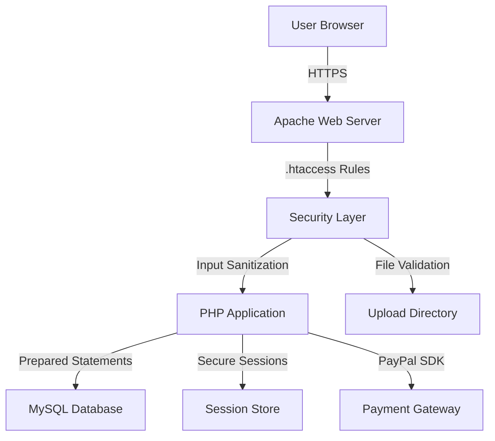

## Overview

SocialiCar implements multiple layers of security to protect user data, prevent common web vulnerabilities, and ensure safe financial transactions. This page documents all security measures implemented in the platform.

<Warning>
  Security is an ongoing process. Regular updates, monitoring, and security audits are essential for production deployments.
</Warning>

## Security Architecture



## Authentication & Authorization

### Password Security

SocialiCar uses PHP's native password hashing functions with bcrypt algorithm.

<Tabs>
  <Tab title="Password Hashing">
    ```php src/pages/usuario/registro.php
    // Password validation rules
    if (strlen($contrasena) < 7 || strlen($contrasena) > 20) {
        $err_contrasena = "La contraseña tiene que tener como minimo 7 y como maximo 20 caracteres";
    }
    
    $patron = "/^(?=.*[a-z])(?=.*[A-Z])(?=.*\d).+$/";
    if (!preg_match($patron, $contrasena)) {
        $err_contrasena = "La contraseña tiene que tener al menos 1 mayuscula, 1 minuscula y 1 numero";
    }
    
    // Hash password with bcrypt (default cost factor: 10)
    $contrasena_cifrada = password_hash($contrasena, PASSWORD_DEFAULT);
    ```
  </Tab>
  
  <Tab title="Password Verification">
    ```php src/pages/usuario/iniciar_sesion.php
    $sql = $_conexion->prepare("SELECT * FROM usuario WHERE correo = ?");
    $sql->bind_param("s", $correo);
    $sql->execute();
    $resultado = $sql->get_result();
    
    if ($resultado->num_rows == 0) {
        $err_correo = "El correo electrónico no existe";
    } else {
        $datos_usuario = $resultado->fetch_assoc();
        
        // Secure password verification
        $acceso_concedido = password_verify($contrasena, $datos_usuario["contrasena"]);
        
        if ($acceso_concedido) {
            $_SESSION["usuario"] = $datos_usuario;
            header("location: ../../../index.php");
            exit();
        } else {
            $err_contrasena = "La contraseña es incorrecta";
        }
    }
    ```
  </Tab>
  
  <Tab title="Requirements">
    <CardGroup cols={2}>
      <Card title="Length" icon="ruler">
        7-20 characters
      </Card>
      <Card title="Complexity" icon="lock">
        1 uppercase, 1 lowercase, 1 digit
      </Card>
      <Card title="Algorithm" icon="key">
        BCrypt (PASSWORD_DEFAULT)
      </Card>
      <Card title="Storage" icon="database">
        Hashed, never plain text
      </Card>
    </CardGroup>
  </Tab>
</Tabs>

<Info>
  `PASSWORD_DEFAULT` uses bcrypt with automatic cost adjustment as hardware improves. Current default cost is 10.
</Info>

### Session Management

Secure session handling prevents session hijacking and fixation attacks.

```php
// Secure session configuration
error_reporting(E_ALL);
ini_set("display_errors", 1);
session_start();

// Authentication check
if (!isset($_SESSION['usuario'])) {
    header("Location: ../../../");
    exit();
}

// User online status tracking
$sql = $_conexion->prepare("UPDATE usuario SET estado = 1 WHERE identificacion = ?");
$sql->bind_param("s", $datos_usuario["identificacion"]);
$sql->execute();
```

**Recommended PHP.ini Settings:**

```ini php.ini
session.cookie_httponly = 1      ; Prevent JavaScript access
session.cookie_secure = 1        ; HTTPS only
session.use_strict_mode = 1     ; Reject uninitialized session IDs
session.use_only_cookies = 1    ; No session IDs in URLs
session.cookie_samesite = Strict ; CSRF protection
```

### Logout Security

```php src/pages/usuario/cerrar_sesion.php
// Update user status before destroying session
$sql = $_conexion->prepare("UPDATE usuario SET estado = 0 WHERE identificacion = ?");
$sql->execute();

// Destroy session completely
session_unset();
session_destroy();
header("Location: ../../../");
exit();
```

## Input Validation & Sanitization

### Universal Sanitization Function

All user input passes through the `depurar()` function:

```php src/config/depurar.php
function depurar(string $entrada) : string {
    $salida = htmlspecialchars($entrada);    // Convert special chars to HTML entities
    $salida = trim($salida);                  // Remove whitespace
    $salida = stripslashes($salida);          // Remove backslashes
    $salida = preg_replace('!\s!', ' ', $salida); // Normalize whitespace
    return $salida;
}
```

<Info>
  `htmlspecialchars()` converts characters like `<`, `>`, `&`, `"`, `'` to HTML entities, preventing XSS attacks.
</Info>

### Validation Rules by Data Type

<Tabs>
  <Tab title="Email Validation">
    ```php
    // Check uniqueness
    $sql = $_conexion->prepare("SELECT * FROM usuario WHERE correo = ?");
    $sql->bind_param("s", $correo);
    $sql->execute();
    $resultado = $sql->get_result();
    
    if ($resultado->num_rows == 1) {
        $err_correo = "El correo ya existe";
    }
    
    // Validate format
    if (filter_var($correo, FILTER_VALIDATE_EMAIL) == false) {
        $err_correo = "El correo tiene que tener el @ y el . bien colocados";
    }
    ```
  </Tab>
  
  <Tab title="Spanish ID Validation">
    ```php
    $identificaciones = ["dni", "nie", "nif"];
    
    if (!in_array($tipo_identificacion, $identificaciones)) {
        $err_tipo_identificacion = "Tienes que elegir un tipo de identificación existente";
    }
    
    // DNI: 8 digits + letter
    if ($tipo_identificacion == "dni") {
        $patron = "/^[0-9]{8}[A-Za-z]$/";
        if (!preg_match($patron, $identificacion)) {
            $err_identificacion = "La DNI debe tener 8 digitos y una letra al final";
        }
    }
    
    // NIE: X/Y/Z + 7 digits + letter
    elseif ($tipo_identificacion == "nie") {
        $patron = "/^[XYZ][0-9]{7}[A-Za-z]$/";
        if (!preg_match($patron, $identificacion)) {
            $err_identificacion = "El NIE debe tener una X,Y o Z, siguiendo de 7 digitos y una letra al final";
        }
    }
    ```
  </Tab>
  
  <Tab title="Phone Validation">
    ```php
    $patron = "/^\d{9,15}$/";
    if (!preg_match($patron, $telefono)) {
        $err_telefono = "El teléfono debe contener solo dígitos y tener entre 9 y 15 números";
    }
    ```
  </Tab>
  
  <Tab title="Name Validation">
    ```php
    // Only letters and common Spanish characters
    $patron = "/^[a-zA-Z0-9 áéióúÁÉÍÓÚñÑüÜ'-]+$/";
    if (!preg_match($patron, $nombre)) {
        $err_nombre = "El nombre solo puede tener letras";
    }
    ```
  </Tab>
  
  <Tab title="License Plate">
    ```php
    // Normalize: uppercase, remove separators
    $matricula = strtoupper($tmp_matricula);
    $matricula = preg_replace("/[\s\-\.,:]/", "", $matricula);
    
    // Modern format: 1234BCD
    $patron_actual = "/^[0-9]{4}[BCDFGHJKLMNPRSTVWXYZ]{3}$/";
    
    // Old format: MA1234AB
    $patron_antiguo = "/^[A-Z]{1,2}[0-9]{4,6}[A-Z]{0,2}$/";
    
    if (!preg_match($patron_actual, $matricula) && !preg_match($patron_antiguo, $matricula)) {
        $err_matricula = "La matrícula no es válida";
    }
    ```
  </Tab>
</Tabs>

## SQL Injection Prevention

All database queries use **prepared statements** with parameter binding.

<CodeGroup>

```php ✅ SECURE - Prepared Statements
// User lookup - SECURE
$sql = $_conexion->prepare("SELECT * FROM usuario WHERE correo = ?");
$sql->bind_param("s", $correo);
$sql->execute();
$resultado = $sql->get_result();

// Vehicle insertion - SECURE
$sql = $_conexion->prepare("INSERT INTO coche (
    matricula, marca, modelo, precio, id_usuario
) VALUES (?, ?, ?, ?, ?)");
$sql->bind_param("sssds", $matricula, $marca, $modelo, $precio, $id_usuario);
$sql->execute();

// Complex query with multiple conditions - SECURE
$sql = $_conexion->prepare("
    SELECT coche.* FROM coche
    WHERE provincia = ?
    AND precio BETWEEN ? AND ?
    AND NOT EXISTS (
        SELECT 1 FROM reserva_coche 
        WHERE matricula = coche.matricula 
        AND fecha_inicio <= ? AND fecha_final >= ?
    )
");
$sql->bind_param("sddss", $provincia, $min_precio, $max_precio, $fecha_fin, $fecha_inicio);
```

```php ❌ INSECURE - String Concatenation
// NEVER DO THIS - Vulnerable to SQL injection
$sql = "SELECT * FROM usuario WHERE correo = '" . $correo . "'";
$resultado = $_conexion->query($sql);

// NEVER DO THIS - Even with escaping
$correo = mysqli_real_escape_string($_conexion, $correo);
$sql = "SELECT * FROM usuario WHERE correo = '$correo'";
```

</CodeGroup>

<Warning>
  **Parameter Type Specifiers:**
  - `s` = string
  - `i` = integer
  - `d` = double/float
  - `b` = blob
</Warning>

## Cross-Site Scripting (XSS) Prevention

### Output Escaping

All user-generated content is escaped before display:

```php
<!-- User profile display -->
<h5 class='card-title'><?= htmlspecialchars($vehiculo['marca']) ?></h5>
<p class='card-text'><?= htmlspecialchars($vehiculo['descripcion']) ?></p>

<!-- Message display -->
<span class="mensaje"><?= htmlspecialchars($fila["ultimo_mensaje"]) ?></span>

<!-- User name display -->
<span class="nombre"><?= htmlspecialchars($datos["nombre"]) ?></span>
```

### JavaScript Context

```php
// Safe JSON encoding for JavaScript
<script>
const userData = <?= json_encode($user_data, JSON_HEX_TAG | JSON_HEX_AMP) ?>;
const precio = <?= json_encode(number_format($precio, 2, '.', '')) ?>;
</script>
```

<Info>
  `JSON_HEX_TAG` and `JSON_HEX_AMP` flags prevent XSS in HTML context by encoding `<`, `>`, `&`.
</Info>

## File Upload Security

### Validation & Storage

```php src/pages/coche/nuevo_coche.php
// File upload validation
if (!isset($_FILES['img']) || empty($_FILES['img']['name'][0])) {
    $err_imagen = "Debes subir al menos una imagen de tu coche";
} else {
    $tmp_imagen_nombres = $_FILES['img']['name'];
    $tmp_imagen_tipos = $_FILES['img']['type'];
    $imagen_errores = $_FILES['img']['error'];
    
    // MIME type whitelist
    $lista_imagenes = ["image/jpeg", "image/png", "image/jpg"];
    
    for ($i = 0; $i < count($tmp_imagen_nombres); $i++) {
        if ($imagen_errores[$i] === 0) {
            // Validate MIME type
            if (!in_array($tmp_imagen_tipos[$i], $lista_imagenes)) {
                $err_imagen = "El tipo de la imagen no es válido";
                continue;
            }
            
            // Generate safe filename
            $extension = str_replace("image/", ".", $tmp_imagen_tipos[$i]);
            $nuevo_nombre = $marca . "_img" . ($i + 1) . $extension;
            
            // Organized storage path
            $ruta_relativa = "/clients/img/" . $_SESSION["usuario"]["identificacion"] 
                           . "/coche/" . $matricula;
            $ruta_absoluta = $_SERVER['DOCUMENT_ROOT'] . $ruta_relativa;
            
            // Create directory with restricted permissions
            if (!is_dir($ruta_absoluta)) {
                mkdir($ruta_absoluta, 0777, true);
            }
            
            // Move file
            if (move_uploaded_file($tmp_imagen_ubi[$i], $ruta_absoluta . "/" . $nuevo_nombre)) {
                $rutas_imagenes[] = $ruta_relativa . "/" . $nuevo_nombre;
            }
        }
    }
}
```

### Security Measures

<AccordionGroup>
  <Accordion title="MIME Type Validation">
    - Only allow `image/jpeg`, `image/png`, `image/jpg`
    - Check actual file content, not just extension
    - Use `fileinfo` extension for accurate detection
  </Accordion>
  
  <Accordion title="File Size Limits">
    ```ini php.ini
    upload_max_filesize = 20M
    post_max_size = 25M
    max_file_uploads = 10
    ```
  </Accordion>
  
  <Accordion title="Filename Sanitization">
    - Remove special characters
    - Use consistent naming: `{brand}_img{number}.{ext}`
    - Prevent directory traversal (../, ./)
  </Accordion>
  
  <Accordion title="Storage Isolation">
    - User files stored outside web root when possible
    - Organized by user ID: `/clients/img/{user_id}/coche/{matricula}/`
    - Directory indexing disabled via .htaccess
  </Accordion>
</AccordionGroup>

## Web Server Security

### .htaccess Configuration

Apache security rules enforced at web server level:

```apache .htaccess
RewriteEngine On

# Block directory indexing
Options -Indexes

# Block access to sensitive files
<FilesMatch "^(\.env|.*\.json)$">
  Order allow,deny
  Deny from all
</FilesMatch>

# Block access to configuration directories
RewriteCond %{REQUEST_URI} ^/src/(config|fonts|img|js|styles|video)/$
RewriteRule ^ - [F,L]

# Block access to internal directories
RewriteCond %{REQUEST_URI} ^/src/pages/$
RewriteRule ^ - [F,L]

# Allow specific page directories only
RewriteCond %{REQUEST_URI} !^/src/pages/(chat|coche|informacion|pago|rentacar|usuario)/
RewriteRule ^/src/pages/ - [F,L]

# Custom error pages (prevent info disclosure)
ErrorDocument 403 /src/pages/error/403.php
ErrorDocument 404 /src/pages/error/404.php
```

<Warning>
  Never commit `.env` files to version control. Add to `.gitignore`.
</Warning>

### Security Headers

Add to Apache virtual host configuration:

```apache
Header always set X-Frame-Options "SAMEORIGIN"
Header always set X-Content-Type-Options "nosniff"
Header always set X-XSS-Protection "1; mode=block"
Header always set Referrer-Policy "strict-origin-when-cross-origin"
Header always set Content-Security-Policy "default-src 'self'; script-src 'self' 'unsafe-inline' https://www.paypal.com https://cdn.jsdelivr.net; style-src 'self' 'unsafe-inline' https://cdn.jsdelivr.net; img-src 'self' data: https:; font-src 'self' data:; connect-src 'self' https://www.paypal.com"
```

## Payment Security

### PayPal Integration

SocialiCar uses PayPal's official JavaScript SDK for secure payment processing:

```javascript src/pages/pago/paypal.php
paypal.Buttons({
    style:{
        color: 'blue',
        shape: 'pill',
        height: 45,
        label: 'pay'
    },
    createOrder: function(data, actions){
        return actions.order.create({
            purchase_units:[{
                amount:{ value: precio },
                description: concepto
            }] 
        });
    },
    onApprove: function(data, actions){
        actions.order.capture().then(function(detalles){
            // Payment successful - server-side verification recommended
            window.location.href = "../usuario/planes.php";
        });
    },
    onCancel: function(data){
        // Payment cancelled by user
        window.location.href = "../usuario/planes.php";
    },
    onError: function(err) {
        // Payment error - log for investigation
        console.error('PayPal Error:', err);
    }
}).render('#paypal-button-container');
```

### Payment Security Measures

<CardGroup cols={2}>
  <Card title="PCI Compliance" icon="shield-check">
    PayPal handles all card data - no PCI compliance burden on SocialiCar
  </Card>
  
  <Card title="HTTPS Required" icon="lock">
    PayPal SDK requires SSL/TLS encryption for all transactions
  </Card>
  
  <Card title="Server Validation" icon="server">
    Implement webhook handlers to verify payments server-side
  </Card>
  
  <Card title="Amount Verification" icon="dollar-sign">
    Verify payment amount matches expected price before fulfillment
  </Card>
</CardGroup>

<Warning>
  **Recommended Enhancement:** Implement PayPal webhooks for server-side payment verification instead of relying solely on client-side callbacks.
</Warning>

## CSRF Protection

<Note>
  **Current Status:** CSRF protection is not fully implemented. This is a recommended security enhancement.
</Note>

### Recommended Implementation

<Tabs>
  <Tab title="Token Generation">
    ```php
    // Generate CSRF token on session start
    if (empty($_SESSION['csrf_token'])) {
        $_SESSION['csrf_token'] = bin2hex(random_bytes(32));
    }
    ```
  </Tab>
  
  <Tab title="Form Token">
    ```php
    <!-- Add to all forms -->
    <form method="post" action="">
        <input type="hidden" name="csrf_token" 
               value="<?= $_SESSION['csrf_token'] ?>">
        <!-- form fields -->
    </form>
    ```
  </Tab>
  
  <Tab title="Token Validation">
    ```php
    // Validate on POST request
    if ($_SERVER['REQUEST_METHOD'] === 'POST') {
        if (!isset($_POST['csrf_token']) || 
            $_POST['csrf_token'] !== $_SESSION['csrf_token']) {
            die('CSRF token validation failed');
        }
        // Process form...
    }
    ```
  </Tab>
</Tabs>

## Rate Limiting

<Note>
  **Current Status:** Rate limiting is not implemented. Recommended for production.
</Note>

### Recommended Implementation

```php
// Simple IP-based rate limiting
function checkRateLimit($action, $max_attempts = 5, $window_seconds = 300) {
    $ip = $_SERVER['REMOTE_ADDR'];
    $key = "ratelimit_{$action}_{$ip}";
    
    if (!isset($_SESSION[$key])) {
        $_SESSION[$key] = ['count' => 0, 'first_attempt' => time()];
    }
    
    $data = $_SESSION[$key];
    
    // Reset window if expired
    if (time() - $data['first_attempt'] > $window_seconds) {
        $_SESSION[$key] = ['count' => 1, 'first_attempt' => time()];
        return true;
    }
    
    // Check limit
    if ($data['count'] >= $max_attempts) {
        return false; // Rate limit exceeded
    }
    
    $_SESSION[$key]['count']++;
    return true;
}

// Usage
if (!checkRateLimit('login', 5, 300)) {
    die('Too many login attempts. Please try again in 5 minutes.');
}
```

## Security Monitoring

### Error Logging

```php
// Production error handling
error_reporting(E_ALL);
ini_set('display_errors', 0);  // Don't show errors to users
ini_set('log_errors', 1);
ini_set('error_log', '/var/log/php/socialicar_error.log');
```

### Suspicious Activity Detection

<AccordionGroup>
  <Accordion title="Failed Login Attempts">
    Log and monitor repeated failed login attempts from same IP:
    
    ```php
    if (!$acceso_concedido) {
        error_log("Failed login attempt for email: $correo from IP: " . $_SERVER['REMOTE_ADDR']);
    }
    ```
  </Accordion>
  
  <Accordion title="File Upload Anomalies">
    Monitor unexpected file types or sizes:
    
    ```php
    if (!in_array($file_type, $allowed_types)) {
        error_log("Suspicious upload attempt: $file_type from user: " . $_SESSION['usuario']['identificacion']);
    }
    ```
  </Accordion>
  
  <Accordion title="SQL Error Monitoring">
    Log database errors for investigation:
    
    ```php
    if ($sql->errno) {
        error_log("SQL Error: " . $sql->error . " - Query: " . $sql->sqlstate);
    }
    ```
  </Accordion>
</AccordionGroup>

## Security Checklist

<Steps>
  <Step title="Authentication">
    <Check>Passwords hashed with bcrypt</Check>
    <Check>Session cookies httpOnly and secure</Check>
    <Check>Session regeneration on login</Check>
    <Check>Logout destroys session completely</Check>
  </Step>
  
  <Step title="Input Validation">
    <Check>All input sanitized with depurar()</Check>
    <Check>Email format validation</Check>
    <Check>Spanish ID format validation</Check>
    <Check>Phone number validation</Check>
    <Check>License plate format validation</Check>
  </Step>
  
  <Step title="SQL Security">
    <Check>All queries use prepared statements</Check>
    <Check>No string concatenation in queries</Check>
    <Check>Parameter types specified correctly</Check>
  </Step>
  
  <Step title="XSS Prevention">
    <Check>htmlspecialchars() on all output</Check>
    <Check>JSON encoding with security flags</Check>
    <Check>No user content in script tags</Check>
  </Step>
  
  <Step title="File Upload Security">
    <Check>MIME type whitelist enforced</Check>
    <Check>File size limits configured</Check>
    <Check>Filenames sanitized</Check>
    <Check>Storage outside web root</Check>
    <Check>Directory indexing disabled</Check>
  </Step>
  
  <Step title="Server Security">
    <Check>.env file not web-accessible</Check>
    <Check>Directory indexing disabled</Check>
    <Check>Error pages don't leak info</Check>
    <Check>HTTPS enforced (HSTS)</Check>
    <Check>Security headers configured</Check>
  </Step>
  
  <Step title="Payment Security">
    <Check>PayPal SDK properly configured</Check>
    <Check>HTTPS required for transactions</Check>
    <Check>Amount verification implemented</Check>
    <Check>Webhook validation (recommended)</Check>
  </Step>
</Steps>

## Security Enhancements (Recommended)

<CardGroup cols={2}>
  <Card title="CSRF Protection" icon="shield-halved">
    Implement token-based CSRF protection for all state-changing operations
  </Card>
  
  <Card title="Rate Limiting" icon="gauge-high">
    Add rate limiting for login attempts, registration, and API calls
  </Card>
  
  <Card title="Two-Factor Auth" icon="mobile">
    Implement 2FA for enhanced account security
  </Card>
  
  <Card title="Content Security Policy" icon="file-shield">
    Configure strict CSP headers to prevent XSS
  </Card>
  
  <Card title="Security Audits" icon="magnifying-glass">
    Regular penetration testing and vulnerability scanning
  </Card>
  
  <Card title="Webhook Validation" icon="webhook">
    Server-side payment verification via PayPal webhooks
  </Card>
</CardGroup>

## Incident Response

<Accordion title="Security Breach Protocol">
  1. **Isolate**: Immediately disable affected services
  2. **Assess**: Determine scope and impact of breach
  3. **Notify**: Inform affected users per GDPR requirements
  4. **Remediate**: Fix vulnerabilities and rotate credentials
  5. **Monitor**: Enhanced logging and monitoring post-incident
  6. **Document**: Create incident report for future prevention
</Accordion>

## Compliance Considerations

<Warning>
  **GDPR Compliance**: SocialiCar collects personal data from EU citizens. Ensure compliance with:
  - Data minimization
  - User consent mechanisms
  - Right to deletion/portability
  - Data breach notification procedures
</Warning>

## Next Steps

<CardGroup cols={3}>
  <Card title="Architecture" icon="diagram-project" href="/technical/architecture">
    Understand system architecture
  </Card>
  
  <Card title="Database" icon="database" href="/technical/database-schema">
    Review database schema
  </Card>
  
  <Card title="Deployment" icon="rocket" href="/technical/deployment">
    Deploy with security hardening
  </Card>
</CardGroup>